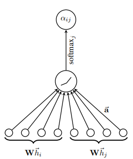

# 图神经网络之GAT
GAT论文地址：[GRAPH ATTENTION NETWORKS](https://arxiv.org/pdf/1710.10903.pdf)
## 1.什么是GAT
GAT 是 Graph Attention Network（图注意力网络）的缩写，它是在GCN的基础上添加了注意力机制，在聚合邻居特征时考虑到不同的邻居的重要性，用注意力机制对邻近节点特征加权求和。
邻近节点特征的权重完全取决于节点特征，独立于图结构。**GAT和GCN的核心区别在于如何收集并累和距离为1的邻居节点的特征表示。** 图注意力模型GAT用注意力机制替代了GCN中固定的标准化操作。**本质上，GAT只是将原本GCN的标准化函数替换为使用注意力权重的邻居节点特征聚合函数。**

**GAT优点：**
- 在GAT中，图中的每个节点可以根据邻节点的特征，为其分配不同的权值。
- 引入注意力机制之后，只与相邻节点有关，即共享边的节点有关，无需得到整张图的信息：(1)该图不需要是无向的(如果边缘 $j\to i$ 不存在，我们可以简单地省略计算$\alpha_{ij}$​；(2)它使我们的技术直接适用于inductive &ThickSpace; learning inductive——包括在训练期间完全看不见的图形上的评估模型的任务。
## 2.GAT核心原理   
**注意力系数的确定：**
$$e_{ij}=a([Wh_i || Wh_j]),  j \in N_i$$
$$\alpha_{ij}=\frac{exp(LeakyReLU(e_{ij}))}{\sum_{k \in N_i} exp(LeakyReLU(e_{ik}))}   $$
$e_{ij}$​和$\alpha_{ij}$​都叫做"注意力系数"，只不过$\alpha_{ij}$​是在$e_{ij}$基础上进行归一化后的。

**加权求和(aggregate)：**
$$h^{'}_i =  \sigma(\sum_{j \in N_i}\alpha_{ij}Wh_j)$$
- W为与特征相乘的权重矩阵
- $\alpha$为前面计算得到的注意力互相关系数
- $\sigma$为非线性激活函数
- $j \in N_i$ 中遍历的$j$表示所有与i ii相邻的节点
- 这个公式表示就是：**该节点的输出特征与和它相邻的所有节点有关，是它们的线性和的非线性激活后得到的。**
**多头注意力Multi-head attention:**

本质上而言：GCN与GAT都是**将邻居顶点的特征聚合到中心顶点上**（一种aggregate操作），利用graph上的local stationary学习新的顶点特征表达。不同的是**GCN利用了拉普拉斯矩阵，GAT利用attention系数**。一定程度上而言，**GAT会更强，因为顶点特征之间的相关性被更好地融入到模型中**

网上看到的一些解答：
为什么GAT适用于有向图？
最根本的原因是GAT的运算方式是**逐顶点的运算（node-wise）**，这一点可从公式（1）—公式（3）中很明显地看出。每一次运算都需要循环遍历图上的所有顶点来完成。逐顶点运算意味着，**摆脱了拉普利矩阵的束缚，使得有向图问题迎刃而解。**

为什么GAT适用于inductive任务？
GAT中重要的学习参数是 W 与 a( ) ，因为上述的**逐顶点运算方式**，这两个参数仅与1.1节阐述的顶点特征相关，与图的结构毫无关系。所以测试任务中改变图的结构，对于GAT影响并不大。  
与此相反的是，GCN是一种**全图的计算方式**，一次计算就更新全图的节点特征。学习的参数很大程度与图结构相关，这使得GCN在inductive任务上遇到困境。

