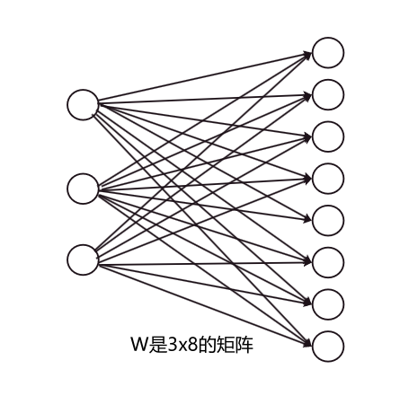

论文地址：[SEMI-SUPERVISED CLASSIFICATION WITH
GRAPH CONVOLUTIONAL NETWORKS](https://arxiv.org/pdf/1609.02907.pdf)

## 1.什么是GCN
GCN，全称Graph Convolutional Networks，即**图卷积网络**。这是一个对图数据进行操作的神经网络架构。GCN其实和CNN（卷积神经网络）类似，本质上都是用来提取特征的工具，只不过CNN处理的对象是二维数据结构，而GCN则用于处理图数据结构。
GCN实际上是一个特征提取器，其精妙之处在于设计了一种从图数据中提取特征的方法，使得我们可以利用这些特征进行节点分类、图分类、边预测以及图的嵌入表示等多种任务。

## 2.GCN核心原理   
GCN的核心思想是通过聚合节点的邻居特征来学习节点的表示，它使用图卷积操作来实现这一目标。GCN的图卷积操作可以表示为以下公式：
$$ 
H = \sigma(AXW) 
$$

其中，$H$ 是更新后的节点表示矩阵，$X$ 是节点的特征矩阵，$\sigma$ 是激活函数，$W$ 是待学习的权重矩阵。
其中公式中的$AX$表示对邻居特征的加权求和，$W$用于将聚合后的特征映射到新的表示空间。直接这么看感觉索然无味，其实妙就妙在$AX$这里，原来所有节点的特征组成了$X$这个特征矩阵，而通过左乘邻接矩阵，便使得每一个节点对应的特征被更新成了它的邻居的特征之和。
以下图为例：

邻接矩阵为
$$
A = 
\begin{bmatrix}
  0 & 0 & 1 & 1 & 0 \\ 
  0 & 0 & 0 & 0 & 1 \\ 
  0 & 1 & 0 & 0 & 0 \\
  0 & 0 & 0 & 0 & 1 \\
  1 & 0 & 0 & 0 & 0 \\
\end{bmatrix}
$$

假设五个节点每个节点的特征是一个长度为3的向量，特征矩阵如下：
$$
X = 
\begin{bmatrix}
 1 & 1 & 5 \\ 
 2 & 1 & 4 \\ 
 3 & 1 & 3 \\
 4 & 1 & 2 \\
 5 & 1 & 1 \\
\end{bmatrix}
$$

那么

$$
AX = 
\begin{bmatrix}
  0 & 0 & 1 & 1 & 0 \\ 
  0 & 0 & 0 & 0 & 1 \\ 
  0 & 1 & 0 & 0 & 0 \\
  0 & 0 & 0 & 0 & 1 \\
  1 & 0 & 0 & 0 & 0 \\
\end{bmatrix}
\begin{bmatrix}
 1 & 1 & 5 \\ 
 2 & 1 & 4 \\ 
 3 & 1 & 3 \\
 4 & 1 & 2 \\
 5 & 1 & 1 \\
\end{bmatrix}=
\begin{bmatrix}
 7 & 2 & 5 \\ 
 5 & 1 & 1 \\ 
 2 & 1 & 4 \\
 5 & 1 & 1 \\
 1 & 1 & 5 \\
\end{bmatrix}
$$

观察 $AX$ 与 $X$ ，我们将以每一行为整体，每一行都是改行对应的节点的特征。
我们可以发现
节点1刚好有两个出边，分别连接了3和4，节点1的特征是原来节点3和节点4的特征之和；
节点2和4只有一个出边，都连接到了5，节点2和4的特征就是原来节点5的特征；
节点3的特征变成了原来的节点2的特征；节点5的特征变成了节点1的特征。
因此邻接矩阵 $A$ 与节点的特征矩阵 $X$ 相乘其实就是将每个节点指向的邻居节点的特征进行了求和。
然后再乘以权重矩阵 $W$ 其实就是对聚合了邻居节点的特征和做了一个线性变换。假设这里的 $W$ 是一个3x8的矩阵，那么变换之后的 $AXW$ 的维数就是(5x3)x(3x8)=(5x8)，其实就是将原来每个节点的特征变成了长度为8的特征。因此这里的 $W$ 就是神经网络中的$W$。我们在训练GCN的时候其实训练的就是这个 $W$ 和 $b$ 。偏置 $b$ 其实是有的，只是在公式中省略了。那你在仔细看下面的这个两个公式有啥区别呢，一个是神经网络中每一层的变换，一个是GCN中每一层的变换，这里的$a$不就是下面的$AW$嘛。   

$$ 
y = \sigma(aW + b) 
$$
$$ 
H = \sigma(AXW+b) 
$$

## 3.GCN的公式 

$$
H^{l+1}=\sigma(\hat D^{-1/2} \hat A \hat D^{-1/2} H^l W^l)
$$

然而我们实际中使用的其实并不是 $H=\sigma(AXW)$，它其实存在两个小问题。
1. 每个节点特征变成了邻居节点的特征之和，但是节点本身的特征却丢失了
2. 因为是对邻居节点的特征进行求和，那么在堆叠多层GCN之后，节点的特征都会变的越来越大。
因此就有了我们实际中使用的 $H^{l+1} = \sigma(\hat D^{-1/2} \hat A \hat D^{-1/2} H^l W^l)$ ，你别看这公式这么长，挺唬人的，但是图确定之后，其实 $\hat D^{-1/2} \hat A \hat D^{-1/2}$ 已经是固定了，你完全可以把它们看成一个常数，而在神经网络的训练过程中，训练的依旧是那个 $W$ 和$b$。
为了解决上面提到的节点本身的特征丢失的问题，我们对原来的图的每个节点加一个自环，用公式写出来也就是 $\hat A = A + I$，这里的$I$是单位矩阵。而 ${\hat D}$ 是 $\hat A$ 的度矩阵。$\hat D^{−1/2} \hat A \hat D^{−1/2}$ 这个操作是对 $\hat A$ 进行对称归一化，也被称为图的归一化邻接矩阵。这种归一化的目的是为了避免某些节点因为邻居数量多而得到不成比例的大权重，或者因为邻居数量少而得到不成比例的小权重。

具体来说，这个归一化的作用如下：
1. **避免度数偏差**：在图中，一些节点可能有很多邻居，而另一些节点可能只有少数邻居。直接使用邻接矩阵进行信息聚合时，度数高的节点可能会主导结果。归一化可以确保每个节点在聚合邻居信息时具有相同的权重，无论其度数如何。
2. **提高数值稳定性**：归一化有助于保持数值的稳定性，特别是在进行多次迭代或深层网络传播时。
3. **理论上的解释**：在某些图嵌入和GCN的理论分析中，这种归一化有助于将问题转化为更易于分析的形式，比如拉普拉斯矩阵的特征分解等。

## 4.网络结构
GCN通常由多个图卷积层组成。每个图卷积层都由以下步骤组成：

输入特征：接收节点特征矩阵 $X$ 和邻接矩阵 $A$ 作为输入。
卷积操作：应用图卷积操作来更新节点表示。
非线性激活：应用非线性激活函数，如ReLU，对节点表示进行激活。
输出特征：输出更新后的节点表示矩阵 $H$ 。

不要被GCN给吓住了，我认为它妙就妙在 $AX$ 得到了邻居节点的特征之和。剩下的就是神经网络中普普通通的一层。而在训练的时候，学习的参数也还是 $W$ 和 $b$ 。
