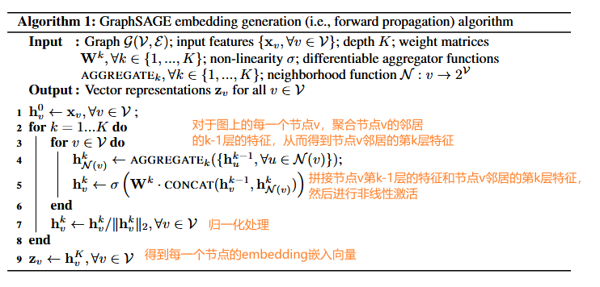
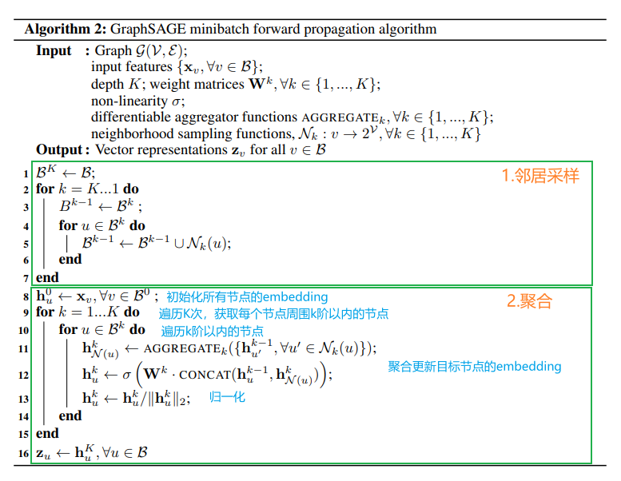
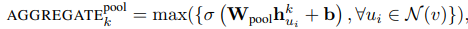
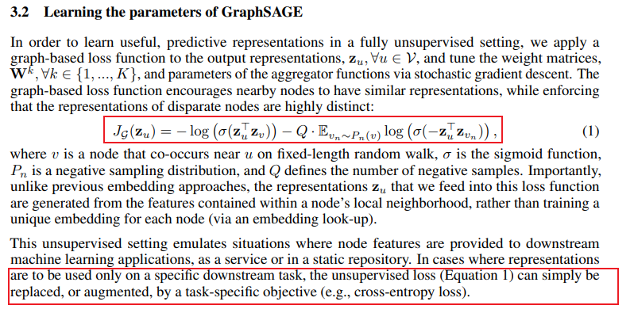

# 图神经网络之GraphSAGE、
论文地址：[Inductive Representation Learning on Large Graphs](https://arxiv.org/pdf/1706.02216.pdf) 
## 1.什么是GraphSAGE

GraphSAGE（Graph Sample and Aggregated）是一种用于图数据的节点嵌入（node embedding）方法。它是一种基于抽样和聚合的图神经网络模型，用于学习节点的低维度表示，以便在图上进行节点分类、链接预测和图节点级别的任务。

GraphSAGE的核心思想是通过邻居节点的信息来学习节点的表示。它首先通过随机抽样的方式选择每个节点的一组邻居节点，然后对这些邻居节点的特征进行聚合，得到每个节点的邻居特征表示。接着，通过对邻居特征进行聚合操作，如平均池化或最大池化，生成节点的嵌入表示。这样，每个节点都可以表示为其邻居节点的特征的聚合。

GraphSAGE的优点在于它能够捕捉节点的局部邻域信息，同时在学习节点嵌入时考虑到了整个图的结构。它适用于处理大规模的图数据，并且可以在不同的图上进行迁移学习，从而具有很好的泛化能力。

先前的方法训练时需要所有的节点都存在，是**直推式(transductive)** 的方法，不能应用到看不见的图上。
在这里，作者提出 GraphSAGE，一个通用的**归纳(inductive)** 框架，  它利用节点特征信息来有效地为以前未见过的数据生成节点嵌入。
GraphSAGE不是为每个节点训练单独的嵌入，而是学习一个通过采样和聚合节点本地邻域的特征来生成嵌入的函数。

 
GraphSAGE能够学习结构信息，但它本质上还是基于特征的。
GraphSAGE学习如何聚合节点本地邻居的特征信息。
## 2.GraphSAGE核心原理    
  
Instead of training a distinct embedding vector for each node, we train a set of aggregator functions that learn to aggregate feature information from a node’s local neighborhood (Figure 1).
我们不是为每个节点训练不同的嵌入向量，而是训练一组聚合器函数，这些函数学习聚合来自节点本地邻域的特征信息（图 1）。

**嵌入生成算法：**   
 
 
**邻居聚合函数：**   
- MEAN aggregator   
   
- Pooling aggregator   
   
- LSTM aggregator   

## 3.参数的学习   
 
注意图片中作者提到了输入到该损失函数中的表示 $Z_u$ 是根据节点本地邻域中包含的特征生成的，而不是为每个节点训练唯一的嵌入。也就是这里的损失函数是经过这个算法
- 无监督学习形式
  基于图的损失函数鼓励附近的节点具有相似的表示，同时强制非临近的节点的表示尽可能区分
- 监督学习形式
  根据具体任务直接设计损失函数，比如交叉熵   

## 参考资料
- [【Graph Neural Network】GraphSAGE: 算法原理，实现和应用 - 浅梦的文章 - 知乎](https://zhuanlan.zhihu.com/p/79637787)
- [GraphSAGE：我寻思GCN也没我牛逼 - 蝈蝈的文章 - 知乎](https://zhuanlan.zhihu.com/p/74242097)
- [GraphSAGE: GCN落地必读论文 - 风浪的文章 - 知乎](https://zhuanlan.zhihu.com/p/62750137)
- http://t.csdnimg.cn/d5M3P
- [Inductive Representation Learning on Large Graphs](https://arxiv.org/pdf/1706.02216.pdf)