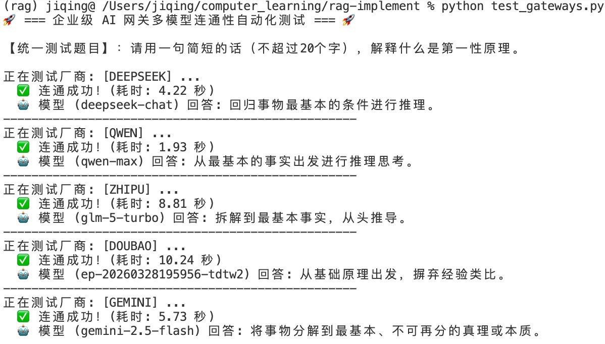
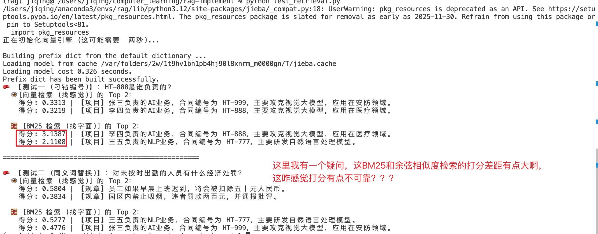
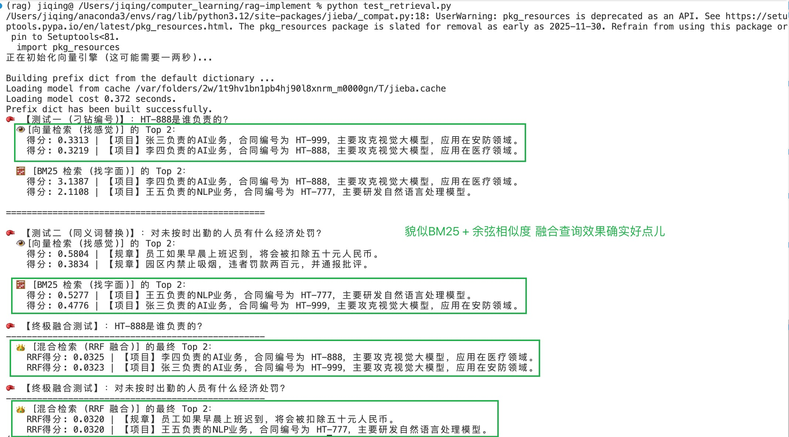
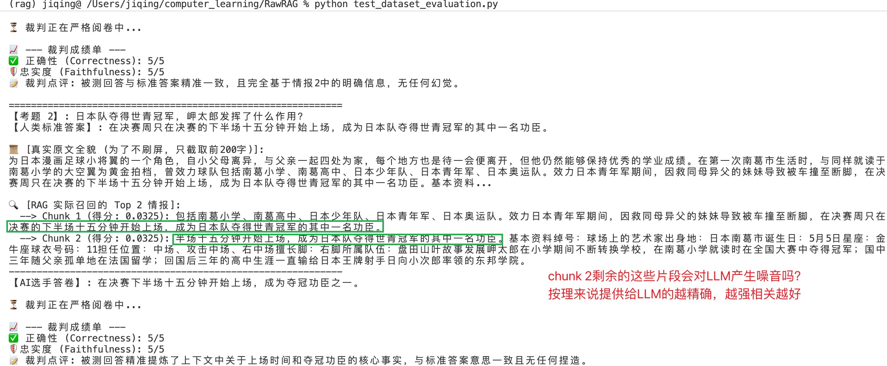
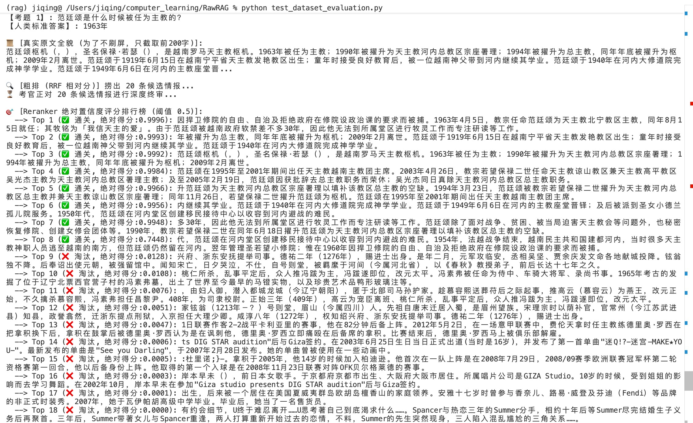

> **写在前面**
> 之前一直想着学学LangChain，LangGraph这些框架，赶快为秋招做准备，学了两天，我又不想动弹了。这两天突然想着能不能手搓一下RAG，现在的AI这么厉害，写起来应该也不困难，等我手搓完之后，再学框架吧。作为信奉第一性原理的开发者，我决定拔掉这些黑盒框架的网线。不调包，纯手写 HTTP 请求、手算向量相似度，BM25检索、手搓排序算法。这篇文章是我开始手搓RAG的第一篇文章，也是记录我从零开始动手真实排坑与顿悟笔记。

## 1. 拆掉黑盒：大模型只是一次带有身份的 HTTP 请求

我觉得在大企业里，肯定不会强依赖某个框架。就拿调用各种大模型API来说，如果框架不兼容部分厂家的API，那岂不是很麻烦。所以一开始，我没有用官方的 SDK，而是用 Python 原生的 `urllib` 纯手工封装了 `LLMGenerator`来调用不同厂家的API。

**我的观察与架构重构：**

* **底层协议的真相**：所谓的大模型调用，本质上就是带上 `Authorization` 和 `User-Agent` 的网络请求。当我加上标准的浏览器 User-Agent 时，DeepSeek 偶尔出现的神秘断连报错瞬间消失了。
* **面向“角色”的架构解耦**：在配置系统时，我意识到绝对不能把模型名字写死。不如后续换用模型，对比不同模型简直头疼。而且我的系统里的模型是有 **“角色 (Role)”**的。比如：
  * `filter_llm`：负责前置快筛RAG检索的结果输出yes或no，要求极速、并发能力强且便宜。
  * `answerer_llm`：负责最终深度推理回答。
  * `judge_llm`：负责严苛的自动化打分，用来评判RAG效果。
    这种基于接口和角色的解耦，让我在后续的 A/B 测试中切换模型如丝般顺滑。

*(注：封装了不同的API之后，这里有一个小观察，我发现各家 API 延迟，差异巨大。虽然暂时对我来说不重要，但是如果这玩意儿在生产环境中使用的话，这些时间差距肯定是要命的，想必调用 API 回答的速度也是一个重要的考量因素，所以先在这里记录一下。)*

## 2. 向量检索的“智障”时刻与 BM25 的救场

然后我用List来展示替代向量数据库，然后搭建好 `Embedder` 和基于余弦相似度的检索器，我本来以为大功告成。但AI帮我生成的测试中有几个带有精确合同号（如 "HT-888"）的对抗样本，毫无悬念地我的检索翻车了。

仔细观察后我发现：

* **向量检索擅长“找感觉”**，但对数字和专有名词极度不敏感。它会把“李四的项目”和“张三的AI项目”算得极其接近，只因为它俩在高维空间里都属于“项目”的聚类。
* **纯手工 BM25 的降维打击**：为了弥补这个致命缺陷，我手写了基于词频和逆文档频率（TF-IDF）变体的 `BM25` 检索器。BM25 就像没有感情的激光制导，只认字面。在测试中，它瞬间锁定了包含 "HT-888" 的唯一片段。

工业界的结论印证了我的实验：**混合检索（Hybrid Search = Vector + BM25）是真实业务的底线。**
*(这一块有一个点我觉得值得记录，目前我用List替代向量数据库，检索的时候其实是需要遍历一遍List的，其实数据多了之后这个效率肯定很烂，想必数据库在查的时候就会对这个做优化)*

## 3. 分数的量纲鸿沟：为什么必须用 RRF 融合？

既然向量和 BM25 各有千秋，自然要把它们融合起来。但当我把两者的分数打印在控制台时，我看到了极其诡异的一幕：

* 向量的得分在 0 到 1 之间徘徊。
* BM25 的得分居然高达 3.13 甚至 6 分以上。

此时我的第一反应是，这两种分数根本不能直接相加。向量算的是“空间几何夹角”，BM25 算的是“词频权重的无上限累加”。把它们按比例融合，就像把苹果的单价和橘子的重量强行相加，毫无数学逻辑可言。

于是乎，我和AI聊天探讨，然后就引入了 **倒数排序融合（RRF）**。既然绝对分数没法比，那就干脆抹除分数，只看“江湖名次”。利用极其优雅的公式 $1 / (60 + Rank)$ 将异构得分统一。主观测试下来，RRF 完美地处理了“偏科”问题。

*(在AI帮我实现的RRF之后，我看到$1 / (60 + Rank)$第一反应是这里凭什么用60？我有点质疑公式的正确性，然后还专门查了一下，这里的60好像是发表RRF的研究者基于经验得到的结果，这里如果的证明，深入的原因啥的我就不写了，有需要让AI帮忙查一下了解一下就行)*

## 4. 最核心的顿悟：Reranker 的“Sigmoid 断崖”与终结固定的 Top-K

看着RRF给我排出来的检索结果，我又陷入了困惑，虽然检索的相关性肉眼可见的上去了，但是每次给我的top-2的结果中，有一条信息依旧是和问题不相关的啊，于是我又开始思考，这里的Top-K到底怎么确定？如果数据库里的相关内容很多，K设置小了，那给LLM的信息必然缺少。K设置大了，给LLM又会返回一些垃圾信息，固定的 K 是完全反逻辑的！这个K肯定得动态变化，这动态的K我又咋确定，不同的问题，真实的K又不一定相同。

为了解决动态 K 的问题，我又引入了本地的 Cross-Encoder 模型（`BAAI/bge-reranker-base`）作为精排考官。在观察它的打分日志时，我发现了一个奇怪的现象：我的两个问题上，检索的结果都出现了**分数不是平滑下降的，而是存在一个断崖（从 0.6175 瞬间暴跌至 0.0750）！**

问了一下AI之后，它给了我一个解释。为什么会产生“断崖”？因为 Reranker 作为一个深度交叉分类器，在神经网络的最末端使用了 **Sigmoid 激活函数**。这个函数的特性是中间极陡，两端极缓。模型被强迫做非黑即白的判断，从而产生了算法工程师梦寐以求的“极化效应”。

借用这个数学特性，我直接在架构中抛弃了 Top-K。我设定了一个绝对置信度阈值（`Threshold = 0.5`）。分数大于 0.5 的全要，小于的全部无情抛弃。
我的系统终于实现了真正的智能路由：**答案多就多喂，没答案就阻断（0 召回），强迫大模型诚实地回答“情报不足”。**

## 5. 极致的防御与量化体系 (LLM Filter & Evaluator)

因为在解决Top-K检索结果中返回结果有不相关的内容时，AI给了我一个新的idea，可以用小模型去判断检索的结果是否相关。于是我又做了下面的尝试。

**高并发 LLM 快筛**：对于金融/医疗等容错率为 0 的场景，连 Reranker 都不能完全信任。我利用多线程并发调用极速小模型，对粗排捞上来的情报做 `YES/NO` 的绝对二元判定。不过这玩意好像早就有研究提出来了，名字叫CRAG，不过我这也算个CRAG 雏形吧。

还有一个问题，每次都是我肉眼观察，主观评判，又累又废眼睛，真的麻，然后AI又给我想了个招数：**LLM-as-a-Judge 自动化跑分**：“无法度量，就无法优化。”我下载了 CMRC 2018 真实数据集作为黄金标尺。让系统自动检索、生成，最后由智谱大模型充当裁判，在 **正确性 (Correctness)** 和 **忠实度 (Faithfulness)** 两个维度进行打分。

有了这套基建，我改动任何一行代码，只要跑个分就知道是对是错，工程的复利齿轮开始转动。
不过这些东西应该都是前沿RAG相关研究早就提出的东西吧，空闲了读读前沿的RAG相关的论文肯定还是很必要的。

## 结语：迈向泥泞的深水区

第一阶段的纯手工拉练结束了。这套代码里没有任何华丽的包装，全是底层的网络请求、向量矩阵、词频统计和线程池并发。但正是这些干枯的代码，让我彻底看透了“检索增强”的本质。然而，真实的工业界绝不会给你喂这么干净的纯文本。真正的考验，是那些包含双栏排版、跨页表格、无形水印的 PDF 研报。
